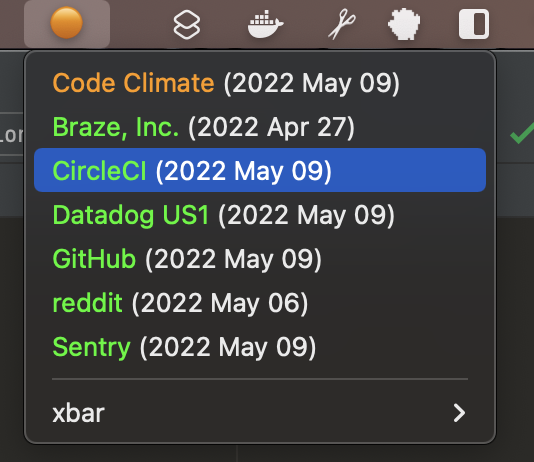

# xbar Plugin: What's Up?

[](https://github.com/sprak3000/xbar-whats-up/actions/workflows/quality-and-tests.yml)
[](https://codeclimate.com/github/sprak3000/xbar-whats-up/maintainability)
[](https://codeclimate.com/github/sprak3000/xbar-whats-up/test_coverage)



This is a plugin for [xbar](https://github.com/matryer/xbar) to quickly show in your macOS menu bar the status of
services you depend on. It currently understands the following formats:

- statuspage.io JSON responses (Example: [reddit Status](https://www.redditstatus.com/api/v2/status.json))
- [Slack API 2.0 JSON responses](https://api.slack.com/docs/slack-status#v2_0_0__current-status-api)

## Requirements

- [xbar](https://github.com/matryer/xbar)

## Configuration

```shell
make create-config
```

Using [CodeClimate's status page](https://status.codeclimate.com/api/v2/status.json) and [Slack's](https://status.slack.com/api/v2.0.0/current)
as examples, we would create an entry in the configuration file like this:

```json
{
  "CodeClimate": {
    "url": "https://status.codeclimate.com/api/v2/status.json",
    "type": "statuspage.io"
  },
  "Slack": {
    "url": "https://status.slack.com/api/v2.0.0/current",
    "type": "slack"
  }
}
```

## Usage

Clone this repo, install dependencies, and build the plugin.

```shell
git clone git@github.com:sprak3000/xbar-whats-up.git
make setup-osx-env
make build
```

Move the binary and configuration to your xbar plugins directory.

```shell
mv whats-up.1h ~/Library/Application\ Support/xbar/plugins/whats-up.1h.cgo
mv whats-up.json ~/Library/Application\ Support/xbar/plugins/.whats-up.json
```

Alternatively, create symbolic links.

```shell
cd ~/Library/Application Support/xbar/plugins
ln -s /path/to/what-up.1h whats-up.1h.cgo
ln -s /path/to/.whats-up.json .whats-up.json
```

## Contributing

You want to contribute to the project? Welcome!

Since this is an open source project, we would love to have your feedback! If you are interested, we would also love to
have your help! Whether helpful examples to add to the docs, or FAQ entries, everything helps. Read our guide on
[contributing](docs/contributing.md), then [set up the tooling](docs/development.md) necessary.
