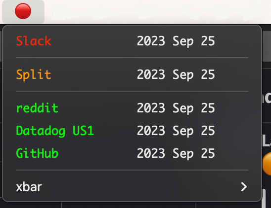

# xbar Plugin: What's Up?



This is a plugin for [xbar](https://github.com/matryer/xbar) to quickly show in your macOS menu bar the status of
services you depend on. It currently understands the following formats:

- statuspage.io JSON responses (Example: [reddit Status](https://www.redditstatus.com/api/v2/status.json))

## Requirements

- [xbar](https://github.com/matryer/xbar)

## Configuration

```shell
cp whats-up.sample.json whats-up.json
```

Using CodeClimate's status page (`https://status.codeclimate.com/api/v2/status.json`) as an example, we would create an
entry in the configuration file like this:

```json
  "CodeClimate": {
    "url": "https://status.codeclimate.com",
    "slug": "/api/v2/status.json"
  }
```

## Usage

Clone this repo and build the plugin.

```shell
make build
```

Move the binary and configuration to your xbar plugins directory.

```shell
mv whats-up.1h ~/.xbar/whats-up.1h.cgo
mv whats-up.json ~/.xbar/whats-up.1h.json
```

Alternatively, create symbolic links.

```shell
cd ~/.xbar
ln -s /path/to/what-up.1h whats-up.1h.cgo
ln -s /path/to/whats-up.json whats-up.json
```
